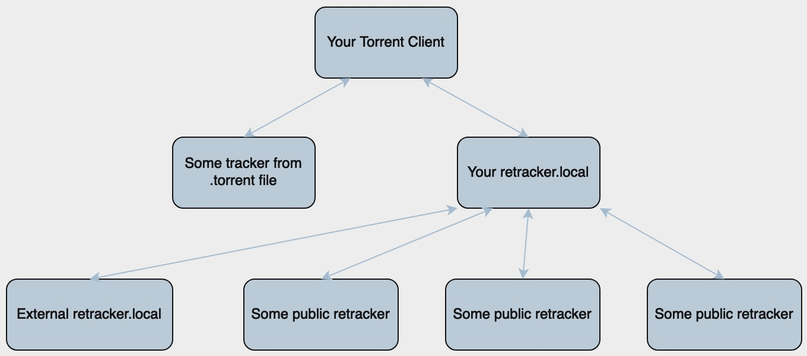

# retracker



Simple HTTP torrent tracker.

* Keep all in memory (no persistent; doesn't require a database).
* Single binary executable (doesn't require a web-backend [apache, php-fpm, uwsgi, etc.])
* Can collect peers from external trackers (HTTP only)
* Expose some metrics for Prometheus monitoring

## Installing

```bash
go install 'github.com/vvampirius/retracker@latest'
```

> Executables are installed in the directory named by the GOBIN environment variable, which defaults to $GOPATH/bin or $HOME/go/bin if the GOPATH environment variable is not set. Executables in $GOROOT are installed in $GOROOT/bin or $GOTOOLDIR instead of $GOBIN.

## Usage

### Docker (Recommended)

The easiest way to run retracker is using Docker Compose.

#### Quick Start

Clone the repository:

```bash
git clone https://github.com/vvampirius/retracker.git
cd retracker
```

Copy the example environment file:

```bash
cp .env.example .env
```

Edit `.env` file to customize your configuration:

```env
HOST_PORT=8080
DEBUG_MODE=false
ENABLE_PROMETHEUS=false
X_REAL_IP=false
PEER_AGE=180
ANNOUNCE_INTERVAL=30
```

Build and start the container:

```bash
docker-compose up -d --build
```

Check logs:

```bash
docker-compose logs -f
```

Stop the container:

```bash
docker-compose down
```

Add http://\<your ip>:8080/announce to your torrent.

#### Docker Configuration

All configuration options can be set via environment variables in the `.env` file:

| Variable | Flag | Description | Default |
|----------|------|-------------|---------|
| `HOST_PORT` | - | External port to expose | `8080` |
| `LISTEN_ADDR` | `-l` | Listen address inside container | `:80` |
| `PEER_AGE` | `-a` | Keep peers in memory for 'n' minutes | `180` |
| `DEBUG_MODE` | `-d` | Enable debug mode | `false` |
| `X_REAL_IP` | `-x` | Get RemoteAddr from X-Real-IP header | `false` |
| `FORWARD_TIMEOUT` | `-t` | Timeout (sec) for forward requests | `2` |
| `ENABLE_PROMETHEUS` | `-p` | Enable Prometheus metrics | `false` |
| `ANNOUNCE_INTERVAL` | `-i` | Announce response interval (sec) | `30` |
| `FORWARDS_FILE` | `-f` | Path to forwards YAML file | empty |

#### Docker with forwarding

To use announce forwarding with Docker:

Create a `forwarders.yml` file in the project root:

```yaml
- uri: http://1.2.3.4:8080/announce
- uri: http://5.6.7.8:8080/announce
- uri: http://5.6.7.8:8080/announce
  ip: 192.168.1.15
- uri: http://192.168.1.1:8080/announce
  host: retracker.local
```

Update your `.env` file:

```env
FORWARDS_FILE=/app/forwarders.yml
```

Uncomment the volumes section in `docker-compose.yml`:

```yml
volumes:
  - ./forwarders.yml:/app/forwarders.yml:ro
```

Rebuild and restart:

```bash
docker-compose up -d --build
```

### Standalone

Start tracker on port 8080 with debug mode.

```bash
retracker -l :8080 -d
```

Add http://\<your ip>:8080/announce to your torrent.

## Behind NGINX

Configure nginx like:

```yml
# cat /etc/nginx/sites-enabled/retracker.local
server {
        listen 80;

        server_name retracker.local;

        access_log /var/log/nginx/retracker.local-access.log;

        proxy_set_header X-Real-IP $remote_addr;

        location /metrics {
                allow 10.0.0.0/8;
                deny  all;
                proxy_pass http://localhost:8080;
        }

        location / {
                proxy_pass http://localhost:8080;
        }
}
```

Start tracker on port 8080 with getting remote address from X-Real-IP header.

```bash
retracker -l :8080 -x -p
```

Add retracker.local to your local DNS or /etc/hosts.

Add <http://retracker.local/announce> to your torrent.

### Standalone with announce forwarding

You can forward announce request to some external HTTP trackers and append peers from them to response to your torrent client.

```bash
retracker -l :8080 -d -f forwarders.yml
```

forwarders.yml:

```yml
- uri: http://1.2.3.4:8080/announce
- uri: http://5.6.7.8:8080/announce
- uri: http://5.6.7.8:8080/announce
  ip: 192.168.1.15 # announce different torrent client IP to this forwarder
- uri: http://192.168.1.1:8080/announce
  host: retracker.local # external retracker.local (like on picture above)
```

Add http://\<your ip>:8080/announce to your torrent.

## License

This project is licensed under the MIT License - see the [LICENSE](LICENSE) file for details
